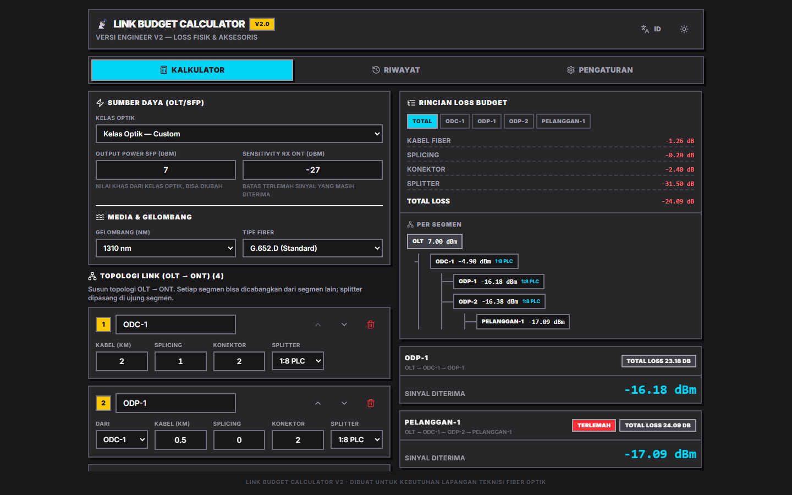
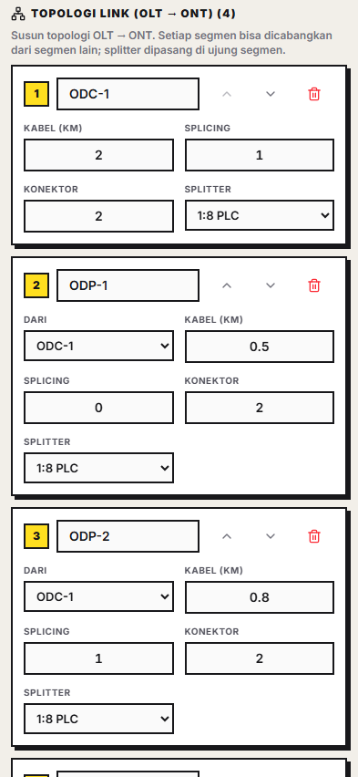

# 📡 Loss Kalkulator FO — Fiber Optic Link Budget Calculator

<p align="center">
  
</p>

A **dual-platform engineering tool** (Web + CLI) that calculates optical power loss and link budgets for FTTH (Fiber to the Home) networks — built for field technicians who need fast, accurate loss budgets without a spreadsheet.

**Purpose-built for real FTTH field work:** OLT → ODC → ODP → ONT topologies, GPON/XGS-PON power budgets, PLC & FBT splitters, and instant PASS/MARGINAL/FAIL verdicts — in the browser *and* in the terminal, powered by **one shared calculation engine**.

## ✨ Highlights

- **Branching topology engine** — model real distribution networks: one ODC feeding many ODPs, each ODP serving customers. Power is traced cumulatively along every parent chain, and every endpoint gets its own path card. The weakest path drives the verdict.
- **Margin & verdict analysis** — optical class presets (GPON B+/C+, XGS-PON N1/N2) or custom TX/RX; margin is graded against sensitivity with a color-coded **LAYAK / MARGINAL / GAGAL** verdict and an automatic recommendation based on the dominant loss contributor.
- **PLC & FBT splitters** — uniform PLC loss (1:2–1:64) and FBT dual-ratio splitters (50:50–99:1) that produce **two outputs**: the main branch and the tapped branch.
- **Per-segment loss breakdown** — pick any segment and see exactly what it costs: cable, splices, connectors, splitter — plus cumulative loss and output power at that point.
- **Editable loss constants** — every standard (splice, connector, attenuation per wavelength, the whole splitter catalog) is adjustable and persists locally.
- **Reports** — export PNG or PDF (A5), copy a WhatsApp-ready text summary, or share the whole topology as a URL.

## 🖥 CLI v2 — same engine, zero dependencies

<p align="center">
  
</p>

The terminal version is not an afterthought — it runs the **same calculation engine** as the web app:

```bash
npm run cli                # interactive full-screen wizard
npm run cli -- --tx 7 --km 10 --splice 5 --conn 4 --splitter 1:8    # one-shot for scripting
npm run cli -- --batch links.csv --out hasil.json                   # recap dozens of links at once
npm run cli -- --history       # results auto-saved, reopen any of them
```

Batch mode reads a CSV of surveyed links and prints a recap table with a verdict per link — built for real survey workflows.

## 🧮 Calculation Standards

| Item | Value |
| --- | --- |
| Fiber cable | 0.35 dB/km @1310 nm · 0.28 @1490 · 0.22 @1550 (G.652.D) |
| Splicing point | 0.1 dB per splice |
| Connectors | 0.3 dB per connection |
| Verdict | margin ≥ +3 dB = PASS · > 0 dB = MARGINAL · ≤ 0 dB = FAIL |

## 🚀 Live Demo & Run Locally

**[Open the Web Calculator](https://kalkulator-redaman.riqo.biz.id/)** — also auto-deployed to GitHub Pages on every push to `main`.

```bash
npm install
npm run dev       # web app at http://localhost:5173
npm run cli       # terminal version
npm run test      # 25 unit tests (web + CLI)
npm run build     # production build to dist/
```

The production build uses relative paths, so `dist/` runs on any static host.

## 🏗 Architecture

Single calculation engine (`shared/`), two frontends — see [ARCHITECTURE.md](./ARCHITECTURE.md).

```
shared/calculator.js   ← the ONLY calculation engine (JS + JSDoc + d.ts)
shared/constants.js    ← splitter catalog, fiber types, optical classes
src/…                  ← web frontend (Vite · React 18 · TypeScript · Tailwind 4)
cli/…                  ← terminal frontend (pure Node ESM, zero dependencies)
```

## 🧪 Quality

- **25 unit tests** covering the engine (reference case parity, FBT dual-path, tree branching, cycles from bad data, input clamping) — run in CI on every push.
- **CI**: typecheck + build + tests on all pushes/PRs; auto-deploy to Pages after a green run.
- **Reference case** validated end-to-end: `7 dBm TX, 10 km, 5 splices, 4 connectors, 1:8 splitter → −8.70 dBm, PASS` on both platforms.

## 📜 License

[MIT](./LICENSE) · v1 is archived under [`legacy/`](./legacy) to show the evolution.
